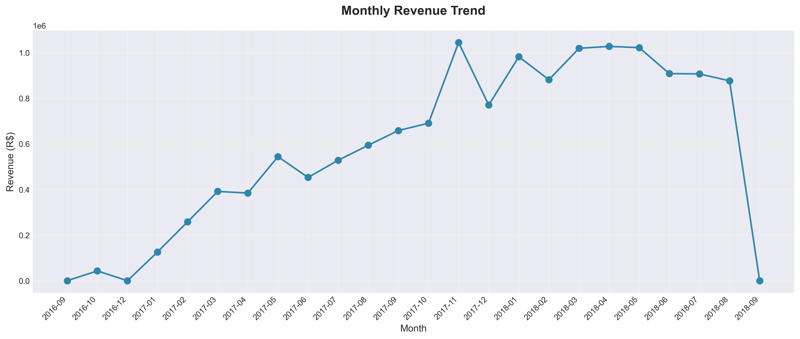
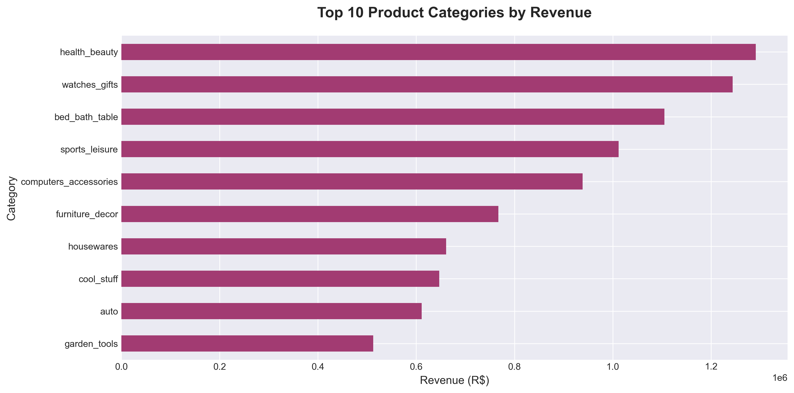
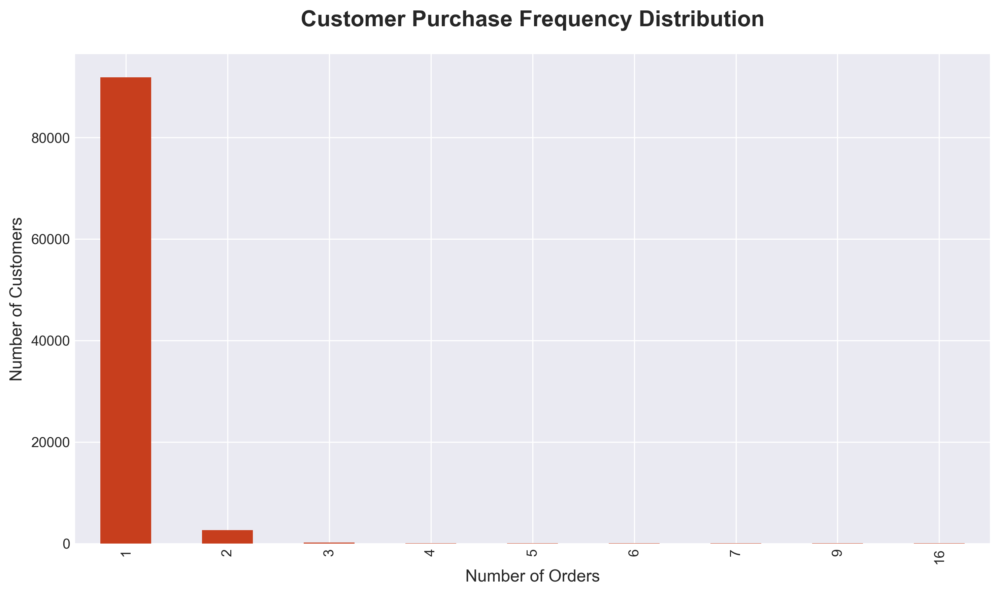
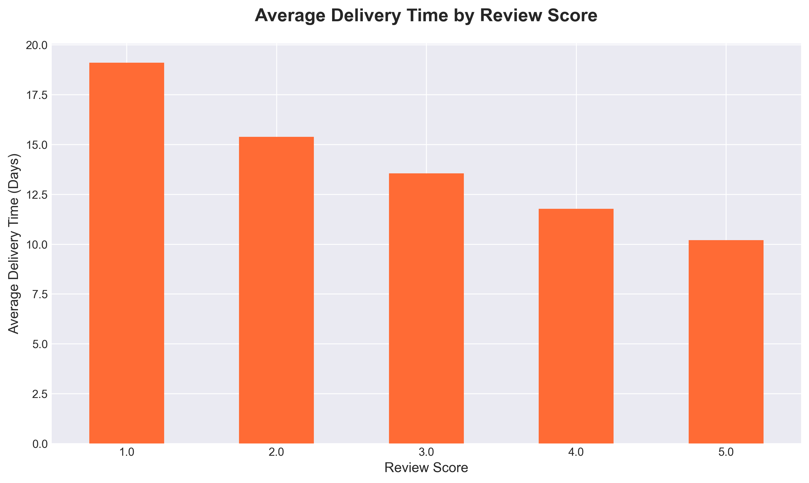

# 📊 E-Commerce Sales & Customer Analysis


## 📌 Project Overview

This project analyzes e-commerce sales trends, customer behavior, and delivery performance to identify revenue drivers and operational bottlenecks. The analysis provides actionable insights for improving business operations, customer retention, and logistics efficiency.

**Business Problem:**  
Analyze sales, customer behavior, and delivery performance to identify revenue drivers and operational issues in the e-commerce business.

---

## 📂 Dataset

**Source:** [Brazilian E-Commerce Public Dataset by Olist](https://www.kaggle.com/datasets/olistbr/brazilian-ecommerce) (Kaggle)

**Dataset Details:**
- **100K+ orders** from 2016 to 2018
- Made at multiple marketplaces in Brazil
- Contains information on:
  - Order status, pricing, payment and freight performance
  - Customer location and demographics
  - Product attributes and categories
  - Customer reviews and ratings
  - Seller information and geolocation

**Data Schema:**
- 9 CSV files with relational structure
- 99,441 customers
- 32,951 products
- 8 product categories (translated to English)

---

## 🎯 Key Insights

### 1. Revenue Concentration
- **Top 20 product categories contribute ~65-70% of total revenue**
- Health & beauty, watches & gifts, and bed/bath/table are top performers
- Clear opportunity to optimize inventory and marketing for these categories

### 2. Customer Retention Challenge
- **Only ~3% of customers make repeat purchases**
- 97% are one-time buyers - massive retention opportunity
- Average customer lifetime value is significantly limited by low retention

### 3. Delivery Performance Issues
- **~7-10% of orders are delivered late**
- Average delivery time: 12 days
- Late deliveries **strongly correlate** with lower review scores
- Certain states have consistently higher delivery delays

### 4. Geographic Concentration
- **Top 3 states (SP, RJ, MG) account for ~50% of customer base**
- Significant opportunity for expansion in underserved regions
- Urban centers drive the majority of sales

### 5. Payment Preferences
- **Credit card is the dominant payment method** (~74% of revenue)
- Boleto (Brazilian payment method) accounts for ~20% of transactions
- Multiple payment installments are common (average 3-4 installments)

### 6. Review Scores Impact
- **Strong negative correlation** between delivery time and review scores
- Orders with 5-star reviews have ~20% faster delivery times
- Customer satisfaction heavily influenced by logistics performance

---

## 💡 Business Recommendations

### 1. **Improve Logistics in High-Delay Regions**
   - Focus on states with highest delivery delays (Northern and remote regions)
   - Partner with regional logistics providers for last-mile delivery
   - Set more realistic delivery estimates to manage expectations

### 2. **Implement Customer Retention Strategy**
   - Launch loyalty program with rewards for repeat purchases
   - Send personalized follow-up emails with discounts on second order
   - Create targeted campaigns for customers 30-60 days after first purchase

### 3. **Optimize Inventory for Revenue Drivers**
   - Prioritize stock for top 20 categories generating 70% of revenue
   - Implement predictive analytics for demand forecasting
   - Analyze seasonal trends for better inventory planning

### 4. **Delivery Performance Monitoring**
   - Set up automated alerts for potential delays
   - Proactive communication with customers about shipping updates
   - Incentivize sellers with faster fulfillment times

### 5. **Geographic Expansion Strategy**
   - Develop localized marketing campaigns for underserved states
   - Offer region-specific promotions to increase market penetration
   - Establish distribution centers in strategic locations

### 6. **Enhance Customer Experience**
   - Streamline checkout process to reduce cart abandonment
   - Improve product descriptions and images
   - Leverage customer reviews as social proof in marketing

---

## 🛠️ Tools & Technologies

- **Python 3.8+**
- **Pandas** - Data manipulation and analysis
- **NumPy** - Numerical computing
- **Matplotlib** - Data visualization
- **Seaborn** - Statistical visualizations
- **Jupyter Notebook** - Interactive development environment

---

## 📊 Analysis Workflow

1. **Data Collection & Understanding**
   - Loaded 9 CSV files and understood relationships
   - Documented schema and key metrics

2. **Data Cleaning**
   - Handled missing values and data type conversions
   - Removed cancelled/unavailable orders
   - Merged multiple tables into master dataset

3. **Feature Engineering**
   - Created delivery time and delay metrics
   - Extracted temporal features (month, year, day, hour)
   - Calculated customer lifetime value

4. **Exploratory Data Analysis**
   - Sales trends analysis (monthly revenue, top categories)
   - Customer behavior analysis (RFM, purchase frequency)
   - Delivery performance analysis (delays, on-time rate)
   - Geographic distribution analysis

5. **Insights & Recommendations**
   - Extracted actionable business insights
   - Formulated data-driven recommendations

---

## 📈 Key Visualizations

### Monthly Revenue Trend

*Clear upward trend in revenue over time with seasonal patterns*

### Top Product Categories

*Revenue concentration in top categories*

### Customer Purchase Frequency

*Majority of customers are one-time buyers*

### Delivery Performance

*Strong correlation between delivery time and customer satisfaction*

---

## 🚀 How to Run

1. **Clone the repository**
   ```bash
   git clone https://github.com/yourusername/ecommerce-analysis.git
   cd ecommerce-analysis
   ```

2. **Install dependencies**
   ```bash
   pip install -r requirements.txt
   ```

3. **Download the dataset**
   - Download from [Kaggle](https://www.kaggle.com/datasets/olistbr/brazilian-ecommerce)
   - Extract the ZIP file into the `data/` folder

4. **Run the Jupyter Notebook**
   ```bash
   jupyter notebook notebooks/ecommerce_analysis.ipynb
   ```

5. **Update the data path** in the notebook (cell #2) to point to your local data folder

6. **Run all cells** to generate analysis and visualizations

---

## 📊 Key Metrics Summary

| Metric | Value |
|--------|-------|
| **Total Revenue** | R$ 13.5M+ |
| **Total Orders** | 99K+ |
| **Total Customers** | 96K+ |
| **Average Order Value** | R$ 137.75 |
| **Repeat Customer Rate** | ~3% |
| **Average Delivery Time** | 12.1 days |
| **On-Time Delivery Rate** | ~93% |
| **Average Review Score** | 4.08/5.0 |

---

## 🔗 Connect With Me

- **LinkedIn:** [https://www.linkedin.com/in/akhilesh-yadav88/]
- **Portfolio:** [https://yaadavakhilesh.github.io/]
- **Email:** yadavakhil766@gmail.com

---

## 📄 License

This project is for educational and portfolio purposes. Dataset is publicly available on Kaggle under their respective license.

---

## 🙏 Acknowledgments

- Dataset provided by [Olist](https://olist.com/) via Kaggle
- Inspired by real-world e-commerce business challenges

---

**⭐ If you found this project helpful, please consider giving it a star!**